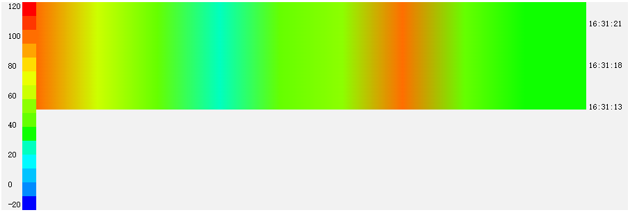
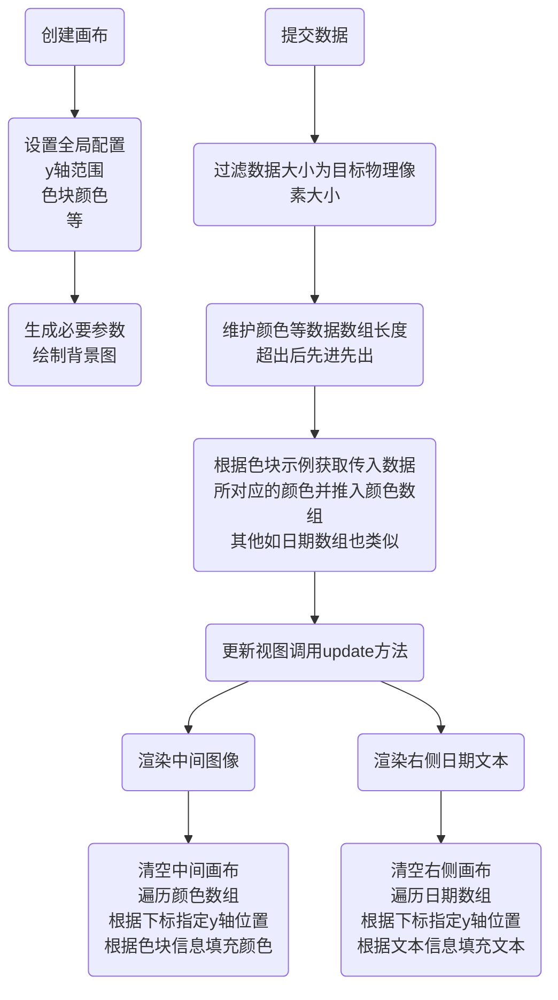

# 一些图表插件

## 一、概述

#### 背景

公司需要做一个瀑布图，在 echarts 中并没有找到类似可直接使用的，于是单独写了一个这样的插件。以防日后新增多种类型图表需求，创建此项目以供使用。

## 二、使用

### 安装

`$ npm install -S rf-charts`

### 使用

```js
// WaterFlow 图表示例
import rfCharts from "rf-charts";
const flow = new rfCharts.WaterFall("canvasID");
const options = {
  // ...配置项，可不填
};
flow.init(options);
flow.update([100, 20, 30]);

```

## 三、图表文档

- 瀑布图 WaterFall
  - 效果说明
    y 轴表示时间，x 轴表示频率，像素颜色表示幅度。随着时间推移，每一时间刻表示的幅度频率信息所在的一行像素条逐渐往下流动。
  - [接口与文档](./docs/waterflow/index.md)
  - 页面示例 `/example/waterfall.html`
  - 图片示例 

### 使用到的 canvas api

- ctx.clearRect 清除矩形区域像素
- ctx.createLinearGradient 创建渐变带
- lineargradient.addColorStop 为渐变带增加渐变色
- ctx.fillRect 根据当前样式配置生成矩形
- ctx.fillText 填充文本
- ctx.save 保存 canvas 样式信息
- ctx.restore 恢复上一次存储的 canvas 样式信息

## 流程说明


